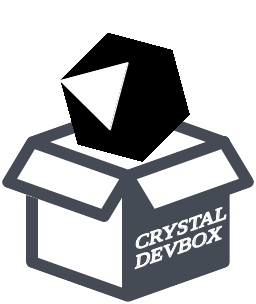

# crystal-devbox

crystal-devbox is a completely dockerized development environment for the Crystal language
on Linux.

The Docker image contains Crystal itself (compiler, playground, etc.),
the API documentation, the crystal-book (language reference), the VSCode editor,
some vsix extensions and the language server crystalline.
Further some important development packages and commandline tools (e.g. git, gcc, make)
are also available inside (look at Dockerfile).  

The basic idea behind was to have a completely bundled development environment
for using offline or behind a firewall. 
The running Docker container includes enough X11 stuff for launching UI tools (Firefox & VSCode).

Basically all necessary programs, tools and packages are living inside the image/container.
However all projects, configurations and other data are awaited outside below the $HOME
directory. 

The user inside and outside of the running container is exactly the same user (uid, gid, etc.),
only the prompt of the shell is changing (starts with a whale and ends with a gemstone) to recognice where you are.

The Docker container starts with several Linux-specific bind mounts. Therefore it's very unlikely that it works on MacOS or Windows.

Ok, the Docker image is not the smallest (2.1GB), but it is as small as possible by build ;-)

## Installation

### Requirements

* A Linux OS
* Docker 19.03.x

## Usage

Build the Docker image by running the shell script **build-image.sh**.
Start the Crystal devbox by running the shell script **run-crystal-devbox.sh**. 

## Development

TODO: Write development instructions here

## Contributing

1. Fork it (<https://github.com/4ndyfix/crystal-devbox/fork>)
2. Create your feature branch (`git checkout -b my-new-feature`)
3. Commit your changes (`git commit -am 'Add some feature'`)
4. Push to the branch (`git push origin my-new-feature`)
5. Create a new Pull Request

## Contributors

- [4ndyfix](https://github.com/4ndyfix) - creator and maintainer
